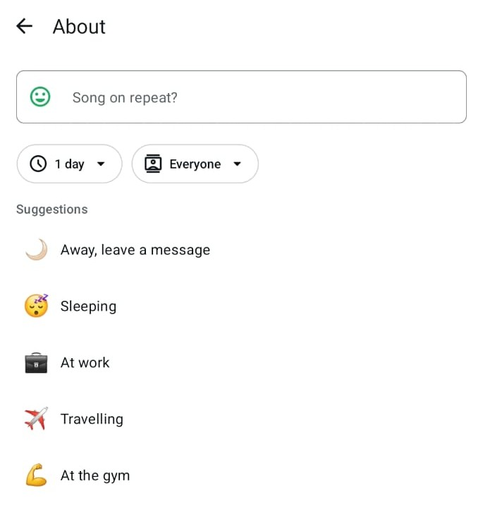
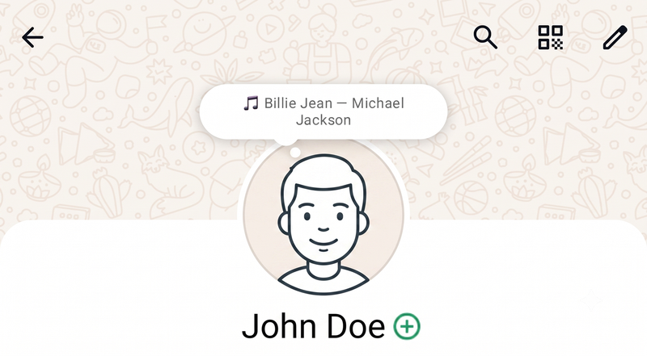
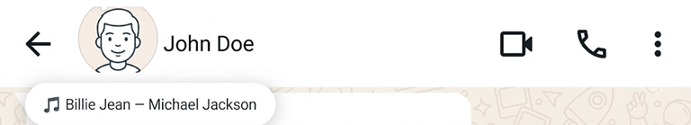

# media-whatsapp-status

Listens for playback webhooks and updates a WhatsApp account's **About text**
(the short persistent profile bio, *not* the 24-hour Status/Stories feature)
with the track currently playing, for one or more configured usernames.
Self-contained: its own dependencies and its own WhatsApp session - nothing
else needs to be running alongside it.

Two sources are supported: **Plex** (a real push webhook) and **Spotify**
(polling, since Spotify has no webhook - see the dedicated section below).
Both normalize into the same shape and share the same `WATCHED_USERS` /
`WATCHED_DEVICES` filtering in `src/server.js`, so adding a source is mostly
about producing that shape, not re-implementing filtering or WhatsApp logic.

## Features

- **Two independent sources** - Plex (a real push webhook) and Spotify
  (adaptive polling) - both feeding the same pipeline, so adding a third
  source later is a small, self-contained addition rather than a rewrite.
  Most similar tools handle only one source, since a push webhook and an
  OAuth polling loop are architecturally very different things to support
  side by side.
- **Per-user and per-device filtering**, shared across every source -
  `WATCHED_USERS` picks whose playback counts; the optional
  `WATCHED_DEVICES` additionally restricts to specific clients/players
  (e.g. only your phone, not the living room TV).
- **Connect-on-demand WhatsApp session** - opens, updates, and closes the
  connection per event instead of staying logged in permanently, closer to
  how briefly opening WhatsApp Web behaves than an always-on bot.
- **Self-hosted, no third-party relay** - talks to WhatsApp and Spotify
  directly; nothing about your playback or your WhatsApp session passes
  through any other server.
- **Debounced and quota-aware** - coalesces rapid track skips into a single
  update, and the Spotify poller backs off adaptively (fast while playing,
  slow while idle, and stops entirely for an unwatched account) since
  Spotify doesn't publish its Development Mode quota numbers.

One thing this project doesn't overlap with: Spotify and WhatsApp have
already shipped a native "share what you're playing" feature (per
[Spotify's own announcement](https://newsroom.spotify.com/2025-11-07/share-spotify-music-whatsapp-instagram-tiktok/),
rolled out globally from November 2025). That's a **manual, one-time share**
of a specific song/playlist/podcast as a visual card into the 24-hour
Status feed - not an automatic, continuously-updated indicator in About -
so it's a genuinely different feature, not a preview of this one.

## About text vs. WhatsApp Status - why this matters

WhatsApp has two different features that share confusing names:

- **Status** (the "Updates" tab): Stories-style posts that auto-expire after
  24 hours and appear in your contacts' feed. Posting one is a heavier
  operation (sending a message to a special broadcast address).
- **About**: a short, persistent text line under your name in your profile
  info (defaults to "Hey there! I am using WhatsApp."). It just stays until
  changed again.

This project updates **About** — right for a continuously-refreshed
"now playing" line. It does **not** post to Status/Stories, which would spam
your contacts with a new expiring story every few minutes. The `updateProfileStatus()`
call this code uses (in `src/whatsappClient.js`) targets the About field
specifically, despite the "status" naming.

WhatsApp redesigned About sometime around mid-2026: it's no longer just a
plain text line. The editor now also has a **duration** ("1 day", etc.) and
an **audience** ("Everyone", etc.) picker, alongside a "Suggestions" quick-set
list — which is exactly why this project's `TRACK_DURATION_SEC` /
`VIDEO_DURATION_SEC` / `IDLE_DURATION_SEC` settings (and the mandatory
`emoji` argument) exist and matter now, where the old plain-text About didn't
have a duration concept at all:



Once set, contacts see it as a **speech-bubble**, not plain text under your
name — both on your profile page:



...and in the header of an open chat with you:



So in practice: this service sets your About text/emoji/duration via
`updateProfileStatus()`, and WhatsApp itself renders that as a bubble
wherever a contact views your profile or chat header — no separate
Status/Story post is ever created.

## How it works

- Registers as a Plex webhook URL. Plex supports multiple registered
  webhooks and POSTs every event to each independently, so this can run
  alongside any other Plex webhook consumer you already have (Tautulli, a
  custom script, etc.) without interfering with it.
- `src/sources/plex.js` filters events to `media.play` / `media.resume` /
  `media.pause` / `media.stop` on `Metadata.type` of `track`, `movie`, or
  `episode`, and normalizes them to
  `{ kind: 'playing', mediaType, title, subtitle, username, deviceName }` /
  `{ kind: 'stopped', username, deviceName }`.
- `src/server.js` then applies `WATCHED_USERS` / `WATCHED_DEVICES` centrally
  (so a future source doesn't need to re-implement the same filter) before
  doing anything else with the event. `WATCHED_USERS` is required - an empty
  list matches nobody. `WATCHED_DEVICES` is optional - an empty list means no
  device restriction; when set, both the user AND the device must match.
- `src/server.js` picks emoji/duration by `mediaType` (tracks get short
  music-length defaults, movies/episodes get long-form-video defaults),
  debounces bursts of events (e.g. skipping tracks), and only then connects to
  WhatsApp, sets the About text, and disconnects again - it does **not** hold
  a permanent WhatsApp connection open.
- `src/sources/spotify.js` runs its own poll loop (no webhook exists for
  this) and calls the same `handleNowPlayingEvent` directly - see the
  Spotify section below for setup and how polling frequency is kept low.
- If both sources are enabled and happen to report around the same time
  (e.g. tracking the same person on both Plex and Spotify), there's no
  merge or priority between them - whichever event lands most recently
  simply becomes the new status, same as two rapid Plex events would.

## Prerequisites (Ubuntu listener box)

- Node.js and npm (already present on this box).
- `build-essential` and `python3` if not already installed, in case a native
  module needs compiling during `npm install`:
  ```bash
  sudo apt-get update && sudo apt-get install -y build-essential python3
  ```
- Outbound internet access from this box (not just LAN) - it connects
  directly to WhatsApp's servers, and to Spotify's API if that source is
  enabled.
- A phone with the target WhatsApp account installed, for the one-time QR
  link.

## Known issue: About updates need an unmerged Baileys fork

As of testing this in August 2026, stable `baileys`'s `updateProfileStatus()`
sends About updates using an old protocol path that WhatsApp's servers
silently ignore - the call succeeds with no error, but nothing changes on
WhatsApp. This is WhiskeySockets/Baileys issue #2727 ("WhatsApp's new About
update"); the fix is open PR #2755, unmerged and flagged stale as of
2026-08-23, available only from the author's fork branch. This project's code
already calls `updateProfileStatus(text, emoji, durationSec)` - the new
3-argument signature that PR introduces - so you need that fork installed,
not the registry package, for About updates to actually work.

Since this is unreviewed, untested-by-maintainers code running against your
real linked WhatsApp session, treat it as an experiment: check back on
[PR #2755](https://github.com/WhiskeySockets/Baileys/pull/2755) periodically
and switch to the real `baileys` release once it merges.

**Confirmed by testing (not just the PR's own claims):** an empty `emoji`
argument causes WhatsApp to silently ignore the whole update, the same as an
empty `text` does. Always pass a non-empty emoji, even for a generic/idle
status with no natural icon - that's why `IDLE_EMOJI` defaults to 💤 rather
than being left blank.

## Install

```bash
cd ~/media-whatsapp-status   # wherever you copy this project on the Ubuntu box
npm install express multer dotenv pino qrcode-terminal
npm install baileys@github:ayusc/Baileys#9a469c7
cp .env.example .env
```

After installing, verify the fork actually has the signature this code
expects before relying on it - I pieced this together from a summarized diff,
not verified source:
```bash
grep -n "updateProfileStatus" node_modules/baileys/lib/Socket/*.js
```
It should show a function accepting three parameters (status, emoji,
duration), not just one. If it doesn't match, the call in
`src/whatsappClient.js` will need adjusting to whatever the real signature is.

Edit `.env`:
- `WATCHED_USERS` - your Plex account username (as it appears in
  `Account.title` on the webhook payload).
- `WATCHED_DEVICES` - optional. Leave empty to allow any device. To restrict,
  list the Plex client/device name(s) exactly as Plex shows them (e.g. under
  Settings -> Devices, or in `Player.title` on the webhook payload) -
  comma-separated, spaces inside a name are fine.
- `PORT` - pick any free port on this box (default `8090`).
- Leave the rest at their defaults for a first test.

## Link WhatsApp (one-time)

Run this in the foreground so you can see the QR code:

```bash
npm run link
```

Scan it from your phone: WhatsApp -> Settings -> Linked Devices -> Link a
Device. On success it prints `Status updated successfully` and exits. Your
WhatsApp About text should now briefly show "media-whatsapp-status linked".

The session is saved under `./auth` (path from `AUTH_DIR` in `.env`). Keep
that folder private and don't commit it - anyone with it can act as your
linked device.

## Run it

```bash
npm start
```

You should see:
```
[server] Listening on port 8090
[server]   Plex webhook path: /webhook/plex
[server] Watching user(s): YourPlexUsername
[server] Watching device(s): (none — all devices allowed)
[server] Spotify polling disabled (SPOTIFY_CLIENT_ID/SECRET not set).
```
(The last line reads "Spotify polling enabled." instead once that source is configured - see below.)

## Point Plex at it

Plex Settings -> Webhooks -> Add Webhook (requires Plex Pass):
```
http://<this-box-ip>:8090/webhook/plex
```
If you already have another webhook registered in Plex for something else,
leave it in place and add this as an additional entry rather than replacing
it - Plex POSTs the same event to every registered webhook.

## Test

1. With `npm start` running in the foreground, play a track in Plex under the
   watched account.
2. Watch the terminal - after `DEBOUNCE_MS` (default 2.5s) you should see
   `[queue] WhatsApp status updated: 🎵 <track> — <artist>`.
3. Check the About text on your WhatsApp profile from another device/contact
   view.
4. Pause/stop playback - if `CLEAR_STATUS_ON_STOP=true` (the default), confirm
   it resets to `IDLE_STATUS_TEXT` after the debounce window; if set `false`,
   the last status simply stays as-is.
5. Try skipping through a few tracks quickly - confirm only one status update
   fires for the final track, not one per skip.

## Run persistently (after testing works)

Either `pm2`:
```bash
npm install -g pm2
pm2 start src/server.js --name media-whatsapp-status
pm2 save
```

Or a systemd unit, e.g. `/etc/systemd/system/media-whatsapp-status.service`:
```ini
[Unit]
Description=Media -> WhatsApp status updater
After=network-online.target

[Service]
Type=simple
WorkingDirectory=/home/<your-user>/media-whatsapp-status
ExecStart=/usr/bin/node src/server.js
Restart=on-failure
User=<your-user>

[Install]
WantedBy=multi-user.target
```
Then:
```bash
sudo systemctl daemon-reload
sudo systemctl enable --now media-whatsapp-status
```

## Spotify source (optional)

Unlike Plex, Spotify has no push webhook for personal accounts - only a
pollable "what's playing" endpoint under OAuth. `src/sources/spotify.js`
polls it in a loop and feeds the same normalized shape into
`handleNowPlayingEvent`, so `WATCHED_USERS`/`WATCHED_DEVICES` apply exactly
like they do for Plex. This is entirely optional - leave
`SPOTIFY_CLIENT_ID`/`SPOTIFY_CLIENT_SECRET` empty in `.env` and the poller
never starts.

### Prerequisites

- A Spotify Developer app, created at the
  [Developer Dashboard](https://developer.spotify.com/dashboard). As of
  February 2026, creating one requires the creating account to have **Spotify
  Premium** - this changed after this project was first written, so don't be
  surprised if older guides don't mention it.
- When creating the app: select only the **Web API** checkbox (not Ads API,
  Web Playback SDK, iOS, or Android - this project only reads playback
  state). Redirect URI can be a placeholder like `http://127.0.0.1:8888/callback`
  - see "Link Spotify" below for why it doesn't need to actually work.
- Apps created this way are in **Development Mode**: capped at 5 authorized
  accounts total (including the app's own creator), each added by email
  under the app's Settings before they can complete the OAuth flow at all.
  Getting past that cap (Extended Quota Mode) requires being an approved
  business with 250k+ monthly active users - not realistic for personal use,
  so 5 accounts is a permanent ceiling here, not a temporary one.
- Spotify doesn't publish exact rate-limit/quota numbers for Development
  Mode apps - `SPOTIFY_POLL_INTERVAL_MS`/`SPOTIFY_IDLE_POLL_INTERVAL_MS`
  below exist specifically because of that uncertainty.

### Link Spotify (one-time, per account)

Add `SPOTIFY_CLIENT_ID`, `SPOTIFY_CLIENT_SECRET`, and `SPOTIFY_REDIRECT_URI`
(matching exactly what's registered on the app) to `.env`, then:

```bash
npm run link:spotify
```

This prints an authorization URL. Open it in **any** browser (it doesn't
need to be this machine) and log in as one of the allowlisted accounts.
After approving, the browser redirects to `SPOTIFY_REDIRECT_URI` - that page
will fail to load, which is expected, since nothing needs to be listening
there. Spotify's server only ever redirects the browser itself; it never
calls that URL from its own backend. Copy the full URL from the address bar
(or just the `code=...` value in it) and paste it back into the running
script. On success, a refresh token is saved to `SPOTIFY_TOKEN_PATH`
(default `./spotify-token.json`) - keep that file private and don't commit
it, same as `auth/` for WhatsApp.

Repeat this once per Spotify account you want tracked (up to the 5-account
cap). Note that this version only polls **one** account's token
(`SPOTIFY_TOKEN_PATH`) - tracking multiple Spotify accounts simultaneously
would need extending `sources/spotify.js` to run one poll loop per saved
token, which isn't built yet.

### How the polling frequency is kept low

Spotify has no long-polling, WebSocket, or webhook option for this data -
confirmed against their own issue tracker, where the feature request for it
has sat open and unimplemented since 2017. Given that, and given Spotify
doesn't publish its Development Mode quota numbers, `sources/spotify.js`
adapts its interval instead of polling at one fixed rate:

- While something is playing: polls every `SPOTIFY_POLL_INTERVAL_MS`
  (default 10s).
- While idle/nothing playing: backs off to `SPOTIFY_IDLE_POLL_INTERVAL_MS`
  (default 60s) - most of a typical day has no active playback, so this is
  where the real savings come from.
- A poll that returns the exact same state as last time never triggers a
  WhatsApp update - only an actual change (new track, paused, stopped)
  does, regardless of how often the interval ticks.
- On a plain rate limit (`429` with a `Retry-After` header), it waits that
  long before polling again. On a quota exhaustion (`429` with
  `"reason": "QUOTA_EXCEEDED"`, a separate, longer-horizon limit Spotify
  added alongside Development Mode), it backs off for an hour - a
  conservative guess, since Spotify doesn't document the actual reset
  window either.
- A rejected/expired access token triggers one fresh refresh-token exchange
  and retries on the next cycle, rather than crashing the process.
- If the linked account's display name isn't in `WATCHED_USERS` at all, the
  poller stops entirely after one check (logging why) rather than polling
  forever for an account that could never pass the filter anyway - add it to
  `.env` and restart the service to enable polling for that account.

## Limitations

Worth knowing before you invest time setting this up:

- **One WhatsApp account per running instance** - the session is process-wide,
  not per-account. Multiple WhatsApp accounts need multiple running
  instances (separate folder, port, and `.env` each) rather than one
  process juggling several sessions.
- **One Spotify account polled at a time** - tracking 2+ Spotify accounts
  into the *same* WhatsApp status isn't built yet (`SPOTIFY_TOKEN_PATH` is
  a single file); see the Spotify section above.
- **Spotify's Development Mode caps out at 5 authorized accounts total**,
  permanently, for personal/hobby use - Extended Quota Mode requires an
  approved business with 250k+ monthly active users.
- **Depends on an unmerged, unofficial Baileys fork** for About updates to
  work at all (see "Known issue" above) - inherently more fragile than
  depending on a released package, and worth re-checking periodically.
- **Spotify updates lag behind Plex's** - up to `SPOTIFY_POLL_INTERVAL_MS`
  (10s by default) after a change, since there's no push option for it,
  versus Plex's near-instant webhook.

## Troubleshooting

| Symptom | Likely cause |
|---|---|
| Nothing logs when you play a track | `WATCHED_USERS` doesn't match `Account.title` exactly (check casing/spelling); if `WATCHED_DEVICES` is set, it also must match `Player.title` exactly (both filters must pass); or the webhook URL registered in Plex is wrong/missing |
| `[whatsapp] Session was logged out...` | The phone unlinked the device, or WhatsApp invalidated the session. Delete the `auth/` folder and run `npm run link` again |
| Status never updates but no errors | `Metadata.type` isn't `"track"` for what you played (e.g. you tested with a movie) |
| Multiple rapid updates on track skip | `DEBOUNCE_MS` too low - increase it |
| `[server] Spotify polling disabled...` at startup | `SPOTIFY_CLIENT_ID`/`SPOTIFY_CLIENT_SECRET` aren't set in `.env` - expected if you haven't set up Spotify |
| `Could not read Spotify refresh token from ...` | Run `npm run link:spotify` first - the poller has nothing to authenticate with until that's done once |
| `[spotify] Access token rejected...` repeating every cycle | The refresh token was revoked (e.g. the account removed app access in their Spotify settings) - delete `spotify-token.json` and run `npm run link:spotify` again |
| `[spotify] Linked account "..." is not in WATCHED_USERS - stopping...` | Expected if that account isn't meant to be tracked. To enable it, add that exact display name to `WATCHED_USERS` in `.env` and restart the service |

## License

MIT - see [LICENSE](LICENSE).
